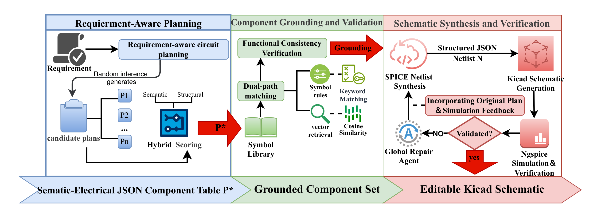

# Analog-LLM-Harness

A Verification-Driven Framework for Harnessing Large Language Models for Analog Circuit Design.

LLM-driven framework that transforms natural-language circuit specifications into simulation-verified, directly editable KiCad schematics. Given a requirement like *"design a 600 Hz Sallen-Key low-pass filter"*, the pipeline decomposes it into a component plan, grounds each component to KiCad-compliant library devices via hybrid neuro-symbolic retrieval, generates and iteratively refines SPICE netlists under Ngspice verification, then deterministically routes the verified netlist into a `.kicad_sch` file. 



## Structure

```
.
├── framework/          # Core pipeline (planner, retriever, SPICE engine, schematic generator)
│   ├── core/           #   NetlistEngine + SpiceEngine
│   └── experts/        #   Circuit-type plugins (filter, BJT, op-amp, Zener, LED driver)
├── baselines/          # Baseline methods (CoT, SelfReflection, ToT, AutoGen, NaiveRAG, CRAG)
├── experiments/        # Datasets + runnable scripts
│   └── datasets/       #   test_cases_v2.json (30 tasks), test_cases_v3.json (10 tasks)
├── experiment_results/ # Pre-computed results → see EXPERIMENTS.md
├── requirements.txt
└── .env.example
```

## Setup

### Prerequisites

Python 3.10 or later.

### Python Dependencies

```
openai>=1.0.0
chromadb>=0.4.0
sentence-transformers>=2.0.0
sexpdata>=1.0.0
```

```bash
pip install -r requirements.txt
```

### External Tools

- **Ngspice** — SPICE simulator. Download from [ngspice.sourceforge.net](http://ngspice.sourceforge.net/). Set `NGSPICE_PATH` env var if not on PATH.
- **KiCad 8** — For opening generated `.kicad_sch` files. Not required for running pipeline experiments.

### Environment Variables

Copy `.env.example` to `.env` and fill in your values.

| Variable | Required | Default | Description |
|----------|----------|---------|-------------|
| `EDA_API_KEY` | Yes | — | LLM API key |
| `EDA_BASE_URL` | Yes | — | LLM API base URL (OpenAI-compatible endpoint) |
| `EDA_MODEL_NAME` | No | `deepseek-ai/DeepSeek-V3.2` | Model identifier |
| `NGSPICE_PATH` | No | `ngspice` (from PATH) | Path to ngspice binary |
| `EDA_CHROMA_DIR` | No | `framework/chroma_db/` | ChromaDB vector store directory |
| `EDA_SPICE_MODELS_DIR` | No | `framework/spice_models/` | SPICE `.lib` files directory |
| `EDA_WORKSPACE_DIR` | No | project-relative | Output directory for experiment workspaces |
| `EDA_GPT_API_KEY` | No | (same as EDA_API_KEY) | Separate key for GPT models in multi-model experiments |
| `EDA_GPT_BASE_URL` | No | (same as EDA_BASE_URL) | Separate endpoint for GPT models |

### Quick Check

```bash
# Verify Ngspice is working
ngspice --version

# Verify Python deps
python -c "import openai, chromadb, sentence_transformers; print('OK')"
```

## Usage

```bash
python experiments/pipeline_comparison/run_pipeline_comparison.py --case-id test_1 --runs 1
python experiments/run_ablation_spice.py         # G0-G4 ablation
python experiments/run_full_pipeline_multi_model.py  # 6-model comparison
```

## Results

All experiment data is in **[experiment_results/EXPERIMENTS.md](experiment_results/EXPERIMENTS.md)** — synthesis ablation (G0-G4), planning-stage ablation (30 tasks, 6 models), multi-model planning/retrieval baseline comparisons, and legacy data. Raw JSON results are in `experiment_results/pipeline_comparison/` and summary CSVs in `experiment_results/simulation_ablation_v3/`.
