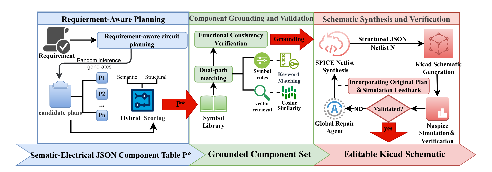

# EDA Last

A verification-driven framework that converts natural-language analog-circuit requirements into SPICE-validated netlists and editable KiCad 8 schematics.

Given a requirement such as *"design a 1 kHz second-order Sallen-Key low-pass filter"*, EDA Last plans the required components, retrieves KiCad library symbols, generates and repairs a SPICE netlist with Ngspice feedback, then exports a `.kicad_sch` schematic.

## Pipeline

```
Requirement -> LLM planning -> component retrieval -> SPICE generation
            -> Ngspice verification and repair -> KiCad schematic
```



## Features

- OpenAI-compatible LLM planning and SPICE generation.
- Hybrid exact-match and semantic component retrieval with ChromaDB.
- Circuit experts for filters, BJT amplifiers, Zener regulators, op-amp amplifiers, and LED drivers.
- Ngspice-based verification and iterative repair.
- Direct generation of editable KiCad 8 schematic files.

## Structure

```
.
├── framework/          # Main design pipeline
│   ├── core/           # SPICE generation and simulation
│   ├── experts/        # Circuit-specific expert modules
│   ├── chroma_db/      # Component vector database
│   └── spice_models/   # Local SPICE models
├── experiments/        # Datasets and comparison scripts
├── baselines/          # Baseline integrations
├── revision/           # Benchmark and evaluator code
├── experiment_results/ # Machine-readable experiment artifacts
├── requirements.txt
└── .env.example
```

## Setup

Requirements: Python 3.10+, Ngspice, and optionally KiCad 8 for viewing generated schematics.

```bash
python -m venv .venv

# Linux/macOS/WSL
source .venv/bin/activate

# Windows PowerShell
# .\.venv\Scripts\Activate.ps1

python -m pip install -r requirements.txt
```

Configure an OpenAI-compatible provider in your shell:

```bash
export EDA_API_KEY="replace-with-your-key"
export EDA_BASE_URL="https://api.example.com/v1"
export EDA_MODEL_NAME="your-model"
export NGSPICE_PATH="ngspice"
```

On Windows PowerShell, use `$env:EDA_API_KEY = "..."` syntax. Do not commit API keys or private provider files.

## Usage

Run the end-to-end interactive workflow:

```bash
python framework/orchestrator.py
```

Enter a circuit requirement when prompted. Generated files are written under `experiment_results/new_runs/workspaces/`, including the SPICE artifacts and `Schematic_Final.kicad_sch`.

Run a single pipeline-comparison case:

```bash
python experiments/pipeline_comparison/run_pipeline_comparison.py \
  --case-id test_1 --runs 1
```

## Notes

- The bundled ChromaDB component catalog is used locally; Sentence Transformer models may download on first use.
- Generated circuits still require engineering review before hardware implementation.
- Markdown experiment-result reports have been removed from the published tree; raw machine-readable artifacts remain.

## License

MIT License. See [LICENSE](LICENSE) and [NOTICE](NOTICE).
